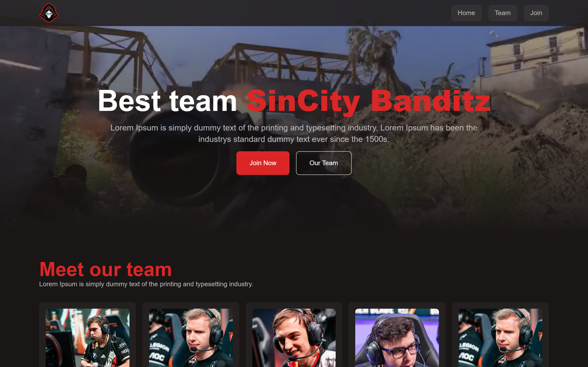

# Sincity Banditz

### Website created for e-sport team to showcase the team.

### https://sincity-banditz.aruzo.it



## Features
- Welcome section 
- Team section 
- Form sending emails

## Build With

- React
- Next
- Tailwind

## Installation and Usage

### Clone this repository

```bash
git clone https://github.com/aruzo1/sincity-banditz.git
cd sincity-banditz
```

### Install Dependencies

```bash
npm install
```

### Run Application

```bash
npm run dev
```

Runs the app in the development mode.\
Open [http://localhost:3000](http://localhost:3000) to view it in the browser.

The page will reload if you make edits.\
You will also see any lint errors in the console.
